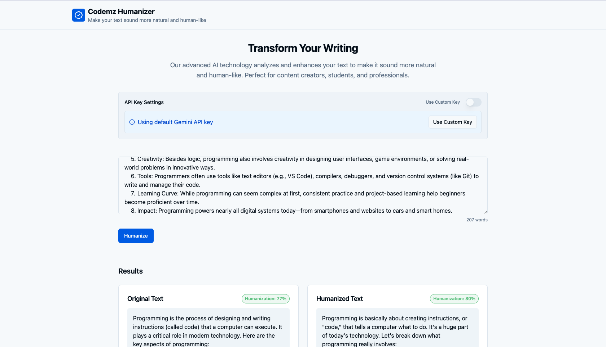

# Codemz Humanizer

Make your text sound more natural and human-like with AI.

## Overview
Codemz Humanizer is a web application that uses advanced AI (Google Gemini API) to analyze and rewrite your text, making it more natural, readable, and human-like. It is ideal for content creators, students, and professionals who want to improve the tone and flow of their writing.

- **Easy to Use:** Paste your text and click the humanize button to transform your writing instantly.
- **Privacy Focused:** Your text is processed locally in your browser and never stored on our servers.
- **High Accuracy:** The app analyzes multiple aspects of your text for comprehensive improvements.
- **Custom or Default API Key:** Use the built-in Gemini API key or provide your own for higher limits.

## Features
- Text humanization using Google Gemini API
- Humanization score and analysis (readability, word diversity, sentence variety, repetition)
- Modern UI with React, Vite, Tailwind CSS, and shadcn/ui components
- No server-side storage of your data

## Getting Started

### Prerequisites
- Node.js (v18 or higher recommended)
- pnpm, npm, or yarn

### Installation
1. Clone the repository:
   ```bash
   git clone https://github.com/MOHAMEDHAMED1S/Text-Humanizer.git
   cd Text-Humanizer
   ```
2. Install dependencies:
   ```bash
   pnpm install
   # or
   npm install
   # or
   yarn install
   ```

### Running the App
Start the development server:
```bash
pnpm dev
# or
npm run dev
# or
yarn dev
```
Visit [http://localhost:8080](http://localhost:8080) in your browser.

## Usage
1. (Optional) Set your own Gemini API key in the API Key Settings for higher usage limits.
2. Paste or type your text in the input form.
3. Click the **Humanize** button.
4. View the original and humanized text, along with a humanization score and analysis.

## Project Structure
- `src/components/` – UI and form components
- `src/lib/` – API and text analysis logic
- `src/pages/` – Main pages (Index, NotFound)
- `src/hooks/` – Custom React hooks

## Customization
- **API Key:** You can use the default Gemini API key or set your own for increased quota.
- **Styling:** Tailwind CSS and shadcn/ui are used for styling. Adjust `tailwind.config.ts` and `src/index.css` as needed.

## License
MIT License. See [LICENSE](LICENSE) for details.

## Credits
Created by [Mohamed Hamed](https://mohamed.codemz.com/). Powered by Google Gemini API.
